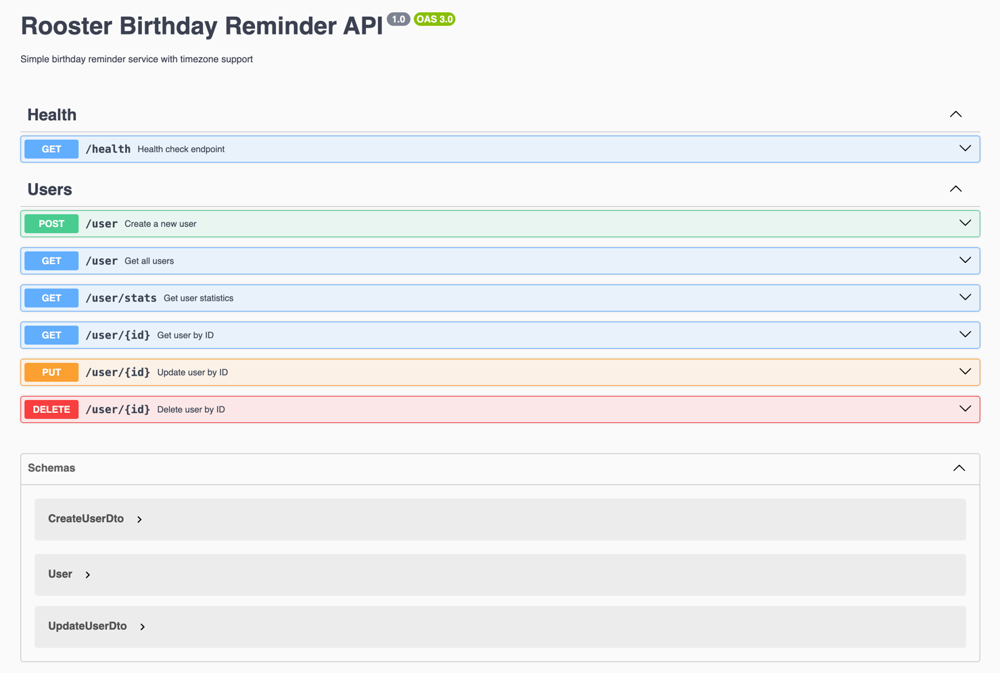
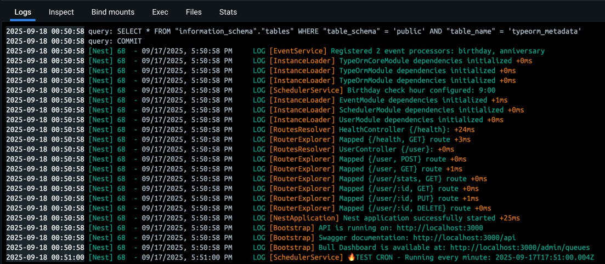
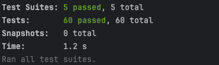

# Rooster Reminder
Birthday Reminder Service

A scalable, timezone-aware birthday reminder service built with NestJS, TypeORM, and Bull Queue

> **⚠️ Hookbin Issue:** Using Pipedream instead of RequestBin/HookBin as originally specified, since RequestBin services are discontinued. Configure `WEBHOOK_URL=https://eob27q1cpxqw604.m.pipedream.net` in `.env` file.

## Architecture Overview
* **NestJS**
   * REST API (Controllers)
   * Event Engine (Schedulers – Cron jobs)
   * Message Queue (Bull)
   * Services: User, Event (extensible), Notification
* **Database Layer**
   * PostgreSQL (relational data)
   * Redis (queue + caching)
   * In-memory: Cron schedule (Bull)

## Code Flow Diagram
[![](https://mermaid.ink/img/pako:eNqVVl1vIjcU_StXs9qmqzpZGL4C2m7FZ0gIhDBkV-0kqsyMAYvBZj2eJmySx75V6kNft_-hvym_pHfs4WtVVS0PCNv3nHvv8bHNoxPIkDk1Z6boag7jxq0A_Lx-DU2pGHQieW9n6v5NzBTUh-fvJurt--bopgXpTHwHx8fvoeF_O5SxninmXV-aCLMI30D7FyY0XMpZ_ObOUtnvpv_y-1_QVFKkIWoNXZkoyz1nwQIaXOl5SNcw5ktmk7Qem4lSKV0aC99Dtd43CC6AijVojPwsBfvheT9RK8U-_cjiJ2j7HS7CHbWpccMwpmrGtEmXksR3-_CBfIKO7y34Cm6E5hEM2IMt46CptqnzzG8qRjXb690kGSpmJlrJKuIBBmxynBlY179OWMLgQk5sfCOJIrBz38GIhTw-SNY1qHP_o1QL3JqhkgGLLdIEY2LUEac1CzSXIgOfG9iF30h4FEIfIXTGDOqoy9YE088FcH0UwzpVeZKJdZTBLwy853sMldQShnzFQmx3aVu88sbwVkn0AlPHS0t-UHXP4C8fP7LJXMoFeEmQlr3Zs0sj98uXX8HN5eCq9wR9v0_VAmgMXnswvjsI-_M3aCsl1RMMtlGd-vllu2Wq8YI5C5OIoXharQ_KQId3aBLhfsuIKSoCZuev_BELpDFk6k1DY_1ZyEGfiyTdNdPC0JqpQ3nEQrvVVnyVJvs5kAlu9TsoZGmHBnTtm1Lgnuu55X5YodnQUjSCBg0WcjrNANfWFF8V3X7QTMR8gk21WMxnwq6MfOu1zAQys_XG6QTqQnBsI6aoAxyfpC61SM8fSM2nqR_RI9CcUyFYZOHZHhHw-h6B9hJbzcC9r8rqsTV00POJYug7OkEGuzb2RzRgeJuIkJsE2SHgmbYvX_6w1oYWj7XiExQ4NM6Nt-utBh46_ikxNBhEOUqdqXTjbw4s1O-pYlsQ3g0pDcqaBuy40J9dKsKIi1lG8cH3MIzuJN0G27Nnz9eunK5UHBNqpE6BO6KtGp5ep9N2HEQ0jltsCivFlyh_eqfClEdR7VWxWe-UcgRbkgtWe-W2K62Cmw2P73mo57XC6oEEMpKqdj_nmn1FyVLz7xF2isVCobwlbJbdU_f0kND9V8JPacf7hJ3qaW5XYbtcym-H_4mQ7fxqGatNt9LYMZbr-Ua1_n8YpxubWT43Xy13Clu-XKtYqecP-fL_xLfHCnXSIG1yRi5Ij_T392k_aECG5Hqn-P5Sl5yTq512-0sj4u1psL8yJjfkw7YbhzhLpvCEhfgYP6Zxt46esyW7dWr4c4qvcaxvnVvxjJE00dJbi8CpTWkUM-Iomczm21GyCvFxaXGKj_pyO7ui4icpcaxVYodO7dF5cGql8km-VMV9dctu1XWL-RJx1k4tXy6clEulUi5XKBTdolsqPxPns2HInxQLrluoViq509Mqeswl-AciLd1y4xsdMtVMb0CnVsmXiYMnXEvVt_81AimmfOY8_w3XfsHa?type=png)](https://mermaid.live/edit#pako:eNqVVl1vIjcU_StXs9qmqzpZGL4C2m7FZ0gIhDBkV-0kqsyMAYvBZj2eJmySx75V6kNft_-hvym_pHfs4WtVVS0PCNv3nHvv8bHNoxPIkDk1Z6boag7jxq0A_Lx-DU2pGHQieW9n6v5NzBTUh-fvJurt--bopgXpTHwHx8fvoeF_O5SxninmXV-aCLMI30D7FyY0XMpZ_ObOUtnvpv_y-1_QVFKkIWoNXZkoyz1nwQIaXOl5SNcw5ktmk7Qem4lSKV0aC99Dtd43CC6AijVojPwsBfvheT9RK8U-_cjiJ2j7HS7CHbWpccMwpmrGtEmXksR3-_CBfIKO7y34Cm6E5hEM2IMt46CptqnzzG8qRjXb690kGSpmJlrJKuIBBmxynBlY179OWMLgQk5sfCOJIrBz38GIhTw-SNY1qHP_o1QL3JqhkgGLLdIEY2LUEac1CzSXIgOfG9iF30h4FEIfIXTGDOqoy9YE088FcH0UwzpVeZKJdZTBLwy853sMldQShnzFQmx3aVu88sbwVkn0AlPHS0t-UHXP4C8fP7LJXMoFeEmQlr3Zs0sj98uXX8HN5eCq9wR9v0_VAmgMXnswvjsI-_M3aCsl1RMMtlGd-vllu2Wq8YI5C5OIoXharQ_KQId3aBLhfsuIKSoCZuev_BELpDFk6k1DY_1ZyEGfiyTdNdPC0JqpQ3nEQrvVVnyVJvs5kAlu9TsoZGmHBnTtm1Lgnuu55X5YodnQUjSCBg0WcjrNANfWFF8V3X7QTMR8gk21WMxnwq6MfOu1zAQys_XG6QTqQnBsI6aoAxyfpC61SM8fSM2nqR_RI9CcUyFYZOHZHhHw-h6B9hJbzcC9r8rqsTV00POJYug7OkEGuzb2RzRgeJuIkJsE2SHgmbYvX_6w1oYWj7XiExQ4NM6Nt-utBh46_ikxNBhEOUqdqXTjbw4s1O-pYlsQ3g0pDcqaBuy40J9dKsKIi1lG8cH3MIzuJN0G27Nnz9eunK5UHBNqpE6BO6KtGp5ep9N2HEQ0jltsCivFlyh_eqfClEdR7VWxWe-UcgRbkgtWe-W2K62Cmw2P73mo57XC6oEEMpKqdj_nmn1FyVLz7xF2isVCobwlbJbdU_f0kND9V8JPacf7hJ3qaW5XYbtcym-H_4mQ7fxqGatNt9LYMZbr-Ua1_n8YpxubWT43Xy13Clu-XKtYqecP-fL_xLfHCnXSIG1yRi5Ij_T392k_aECG5Hqn-P5Sl5yTq512-0sj4u1psL8yJjfkw7YbhzhLpvCEhfgYP6Zxt46esyW7dWr4c4qvcaxvnVvxjJE00dJbi8CpTWkUM-Iomczm21GyCvFxaXGKj_pyO7ui4icpcaxVYodO7dF5cGql8km-VMV9dctu1XWL-RJx1k4tXy6clEulUi5XKBTdolsqPxPns2HInxQLrluoViq509Mqeswl-AciLd1y4xsdMtVMb0CnVsmXiYMnXEvVt_81AimmfOY8_w3XfsHa)

## Features

-  **Timezone-aware scheduling**: Send messages at 9 AM local time
-  **Fault tolerance**: Auto-retry failed messages with exponential backoff (3 attempts: 1min → 2min → 4min delays)
-  **Race condition prevention**: Distributed locking with Redis  (BullMQ)
-  **Extensible architecture**: Easy to add new event types (anniversary...)

## Duplicate Message Prevention

**Multi-Layer Protection Against Duplicate Birthday Messages:**

- **Database Constraints**: Unique index on (userId, eventType, eventYear) prevents duplicate event creation
- **Application Logic**: Service layer checks for existing events before creating new ones
- **Redis Distributed Locks**: 30-second TTL locks prevent concurrent processing of same event
- **Status Validation**: Only processes events with PENDING status, skips SENT/FAILED events

This ensures each user receives exactly one birthday message per year, even under high concurrency or system failures

## Future Extensions

Easy to add new features:

1. New event types (anniversary, holiday, reminders)
   view more:
```javascript
export enum EventType {
  BIRTHDAY = 'birthday',
  ANNIVERSARY = 'anniversary',
  // Easy to extend: HOLIDAY = 'holiday', REMINDER = 'reminder'
}

```
2. New channels (SMS, Push notifications)
   view more:
```shell
src/modules/notification/notification.service.ts
```
3. Advanced scheduling (custom/recurring)
4. Analytics (tracking & reports)


## Project Structure

```
src/
├── modules/
│   ├── user/                   # User management
│   ├── event/                  # Event management (extensible)
│   ├── notification/           # Message delivery  
│   └── scheduler/              # Cron jobs and queue management  
```

## Installation & Setup

### Prerequisites
- Node.js >= 23
- PostgreSQL >= 13
- Redis >= 6

### 1. Install Dependencies
```bash
npm install
```

### 2. Environment Setup
```bash
cp .env.example .env
# Edit .env with your database credentials
```

### 3. Database Setup
```bash
# Generate migration
npm run migration:generate

# Run migrations
npm run migration:run
```

### 4. Start Services
```bash
# Development
npm run start:dev

# Production
npm run start:prod
```

## API Documentation
- **API Documentation**: http://localhost:3000/api


## Monitoring & Observability
- **Health Checks**: `/health` endpoint
- **Queue Dashboard**: Bull Dashboard at http://localhost:3000/admin/queues
- **Logging**: Structured logging with Winston
- **Metrics**: Custom metrics for message delivery

##  Deployment

### Docker
```bash
docker-compose up -d
```

## Unit tests

```bash
npm run test
```
