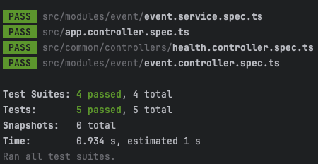

# Rooster Reminder
Birthday Reminder Service

A scalable, timezone-aware birthday reminder service built with NestJS, TypeORM, and Bull Queue

## Architecture Overview
* **NestJS**
   * REST API (Controllers)
   * Event Engine (Schedulers – Cron jobs)
   * Message Queue (Bull)
   * Services: User, Event (extensible), Notification
* **Database Layer**
   * PostgreSQL (relational data)
   * Redis (queue + caching)
* **Testing**
   * Jest + Supertest (E2E & unit tests)

## Code Flow Diagram
[![](https://mermaid.ink/img/pako:eNqVVttu4zYQ_ZWBFtt0USZrS7YSG9stfI1zceJEzi5aJShoaWwTlkUvJTXxJnnsW4E-9HX7D_2mfElHpHxbFEWbByMk55yZOTwk9WgFMkSrbk0UX0xh2LyNgf5ev4aWVAjdSN6bmYZ_k6CCxuDk3Ui9fd-6vmlDPpPcwf7-e2j63w5kkk4UelfnOkIvwjfQ-QXjFM7lJHlzZ6jMb8t_-f0vaCkZ5yFqCT2ZKcM9xWAGTaHSaciXMBRzNEnaj61MqZwuj4Xvodboa4SIgcdLSCnys4zxh-ftRO0c-_QjJk_Q8bsiDjfUusYVw5CrCaY6XU6S3G3DL-QTdH1vJhZwE6ciggt8MGXsNNXRdR77LYU8xa3edZKBQj3RzhaRCChgleNYw3r-VYYZwqkcmfhmFkVg5r6DawxFspOsp1En_kepZrQ1AyUDTAxSB1Ni0pGmUwxSIeMCfKJhp34zE1EIfYLwCWrUXg-XjNJPYxDpXgLLXOVRIdZeAT_V8DPfQ1IylTAQCwyp3blp8dIbwlslyQuo9ueGfKfqM40_f_yIo6mUM_CyIC97tWfnWu6XL7-CXSrB5dkT9P0-VzPgCXidi-HdTtifv0FHKame4GId1W2cnHfauhovmGKYRUjipWq5UwY5vMuziPZbRqh4HKCZv_SvMZDakLk3NY3xp1OCvoizfNd0CwNjpi4XEYZmq434Kk_2cyAz2up34BRpBxp05etS4F6kU8P9sCCzkaV4BE0ezOR4XACujCm-KrrzkGKciBE11cZETGKzcu0brxUmkIWtV05n0IhjQW0knHSA_YPcpQbp-RcyFePcj-QRaE15HGNk4MUeMfD6HoPOnFotwGdflXWGS-iS5zOF5Ds-IgazNvSveYB0m8Sh0AmKQyAKbV--_GGsDW2RpEqMSOBQOzdZr7ebdOjEp0zTUBAXJHWh0o2_OrDQuOcK1yC6G3IakjUP2HCRP3s8DiMRTwqKD75HYXwj6TrYnD1zvjbl9KQSlDAl6hy4IVqr4aXLfNqMg4gnSRvHsFBiTvLndyqMRRTVX1VajW61xKglOcP6K7tz2HbsYrh_L8J0WncWDyyQkVT1-6lI8StKzM2_RditVBzHXRO2XPvIPtoltP-V8FPe8TZht3ZU2lTYcavl9fA_EeLGr4ax1rIPmxtGt1Fu1hr_h3G8spnhs8s1t-us-UrtymGjvMtX_ie-LVZosCbrsGN2ys5Yf3uftoMu2IBdbRTfXuqxE3a50W576Zp5WxpsrwzZDfuw7sZi1hwVnbCQHuPHPO7WSqc4x1urTv-GOM5vq1vrNn6mUJ6l0lvGgVUf8yhBZimZTabrUbYI6XVpC06v-nw9u-DxT1LSOFWZGVr1R-vBqlfdg3K1Rhtru3bNtivlKrOWVr3sOgdutVotlRynYlfsqvvMrM-aoXxQcWzbqR3ZNcc-cm3XYfQFkdduuOmRDlG18ivQqrvVGrPoiKdS9c3Hhv7meP4bGHnBUw?type=png)](https://mermaid.live/edit#pako:eNqVVttu4zYQ_ZWBFtt0USZrS7YSG9stfI1zceJEzi5aJShoaWwTlkUvJTXxJnnsW4E-9HX7D_2mfElHpHxbFEWbByMk55yZOTwk9WgFMkSrbk0UX0xh2LyNgf5ev4aWVAjdSN6bmYZ_k6CCxuDk3Ui9fd-6vmlDPpPcwf7-e2j63w5kkk4UelfnOkIvwjfQ-QXjFM7lJHlzZ6jMb8t_-f0vaCkZ5yFqCT2ZKcM9xWAGTaHSaciXMBRzNEnaj61MqZwuj4Xvodboa4SIgcdLSCnys4zxh-ftRO0c-_QjJk_Q8bsiDjfUusYVw5CrCaY6XU6S3G3DL-QTdH1vJhZwE6ciggt8MGXsNNXRdR77LYU8xa3edZKBQj3RzhaRCChgleNYw3r-VYYZwqkcmfhmFkVg5r6DawxFspOsp1En_kepZrQ1AyUDTAxSB1Ni0pGmUwxSIeMCfKJhp34zE1EIfYLwCWrUXg-XjNJPYxDpXgLLXOVRIdZeAT_V8DPfQ1IylTAQCwyp3blp8dIbwlslyQuo9ueGfKfqM40_f_yIo6mUM_CyIC97tWfnWu6XL7-CXSrB5dkT9P0-VzPgCXidi-HdTtifv0FHKame4GId1W2cnHfauhovmGKYRUjipWq5UwY5vMuziPZbRqh4HKCZv_SvMZDakLk3NY3xp1OCvoizfNd0CwNjpi4XEYZmq434Kk_2cyAz2up34BRpBxp05etS4F6kU8P9sCCzkaV4BE0ezOR4XACujCm-KrrzkGKciBE11cZETGKzcu0brxUmkIWtV05n0IhjQW0knHSA_YPcpQbp-RcyFePcj-QRaE15HGNk4MUeMfD6HoPOnFotwGdflXWGS-iS5zOF5Ds-IgazNvSveYB0m8Sh0AmKQyAKbV--_GGsDW2RpEqMSOBQOzdZr7ebdOjEp0zTUBAXJHWh0o2_OrDQuOcK1yC6G3IakjUP2HCRP3s8DiMRTwqKD75HYXwj6TrYnD1zvjbl9KQSlDAl6hy4IVqr4aXLfNqMg4gnSRvHsFBiTvLndyqMRRTVX1VajW61xKglOcP6K7tz2HbsYrh_L8J0WncWDyyQkVT1-6lI8StKzM2_RditVBzHXRO2XPvIPtoltP-V8FPe8TZht3ZU2lTYcavl9fA_EeLGr4ax1rIPmxtGt1Fu1hr_h3G8spnhs8s1t-us-UrtymGjvMtX_ie-LVZosCbrsGN2ys5Yf3uftoMu2IBdbRTfXuqxE3a50W576Zp5WxpsrwzZDfuw7sZi1hwVnbCQHuPHPO7WSqc4x1urTv-GOM5vq1vrNn6mUJ6l0lvGgVUf8yhBZimZTabrUbYI6XVpC06v-nw9u-DxT1LSOFWZGVr1R-vBqlfdg3K1Rhtru3bNtivlKrOWVr3sOgdutVotlRynYlfsqvvMrM-aoXxQcWzbqR3ZNcc-cm3XYfQFkdduuOmRDlG18ivQqrvVGrPoiKdS9c3Hhv7meP4bGHnBUw)

## Features

-  **Timezone-aware scheduling**: Send messages at 9 AM local time
-  **Fault tolerance**: Auto-retry failed messages with exponential backoff
-  **Race condition prevention**: Distributed locking with Redis  (BullMQ)
-  **Extensible architecture**: Easy to add new event types (anniversary, etc.)

## Future Extensions

Easy to add new features:

1. New event types (anniversary, holiday, reminders)
   view more:
```javascript
export enum EventType {
  BIRTHDAY = 'birthday',
  ANNIVERSARY = 'anniversary',
  // Easy to extend: HOLIDAY = 'holiday', REMINDER = 'reminder'
}

```
2. New channels (SMS, Push notifications)
   view more:
```shell
src/modules/notification/notification.service.ts
```
3. Advanced scheduling (custom/recurring)
4. Analytics (tracking & reports)


## Project Structure

```
src/
├── modules/
│   ├── user/                   # User management
│   ├── event/                  # Event management (extensible)
│   ├── notification/           # Message delivery  
│   └── scheduler/              # Cron jobs and queue management  
```

## Installation & Setup

### Prerequisites
- Node.js >= 18
- PostgreSQL >= 13
- Redis >= 6

### 1. Install Dependencies
```bash
npm install
```

### 2. Environment Setup
```bash
cp .env.example .env
# Edit .env with your database credentials
```

### 3. Database Setup
```bash
# Generate migration
npm run migration:generate

# Run migrations
npm run migration:run
```

### 4. Start Services
```bash
# Development
npm run start:dev

# Production
npm run start:prod
```

## API Documentation
- **API Documentation**: http://localhost:3000/api


## Monitoring & Observability
- **Health Checks**: `/health` endpoint
- **Queue Dashboard**: Bull Dashboard at http://localhost:3000/admin/queues
- **Logging**: Structured logging with Winston
- **Metrics**: Custom metrics for message delivery

##  Deployment

### Docker
```bash
docker-compose up -d
```

## Unit tests

```bash
npm run test
```
